# Literature on 3D seismic cubes and deep learning

## Summary

### *Di2018 Developing a seismic pattern interpretation network (SpiNet) for automated seismic interpretation*

Filename: `Di2018 Developing a seismic pattern interpretation network (SpiNet) for automated seismic interpretation  1810.08517.pdf`

<b>ABSTRACT</b>

Seismic interpretation is now serving as a fundamental tool for depicting subsurface geology and assisting activities in various domains, such as environmental engineering and petroleum exploration. In the past decades, a number of computer-aided tools have been developed for accelerating the interpretation process and improving the interpretation accuracy. However, most of the existing interpretation techniques are designed for interpreting a certain seismic pattern (e.g., faults and salt domes) in a given seismic dataset at one time; correspondingly, the rest patterns would be ignored. Interpreting all the important seismic patterns becomes feasible with the aid of multiple classification techniques. When implementing them into the seismic domain, however, the major drawback is the low efficiency particularly for a large dataset, since the classification need to be repeated at every seismic sample. To resolve such limitation, this study first present a seismic pattern interpretation dataset (SpiDat), which tentatively categorizes 12 commonly- observed seismic patterns based on their signal intensity and lateral geometry, including these of important geologic implications such as faults, salt domes, gas chimneys, and depositional sequences. Then we propose a seismic pattern interpretation network (SpiNet) based on the state- of-the-art deconvolutional neural network, which is capable of automatically recognizing and annotating the 12 defined seismic patterns in real time. The impacts of the proposed SpiNet come in two folds. First, applying the SpiNet to a seismic cube allows interpreters to quickly identify the important seismic patterns as input to advanced interpretation and modeling. Second, the SpiNet paves the foundation for deriving more task-oriented seismic interpretation networks, such as fault detection. It is concluded that the proposed SpiNet holds great potentials for assisting the major seismic interpretation challenges and advancing it further towards cognitive seismic data analysis. Meanwhile, more work is expected for evolving the SpiNet by integrating transfer learning, defining more seismic patterns, feeding more seismic datasets and training labels, and optimizing the network architectures.

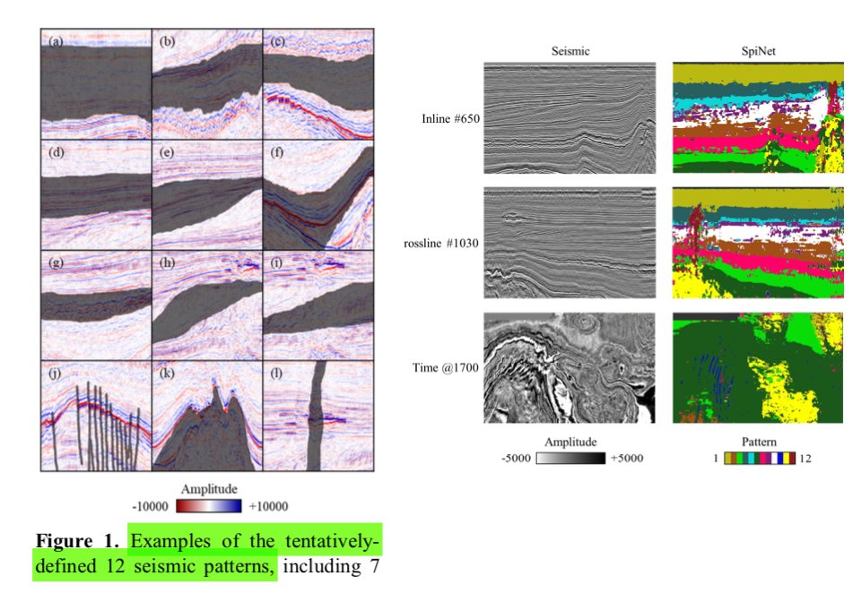

----

### *Egorov2019 Automatic Fault interpretation from seismic data via convolutional neural networks*

Filename: `Egorov2019 Automatic Fault interpretation from seismic data via convolutional neural networks [poster].pdf`

<b>ABSTRACT</b>

These days the most part of oil and gas brownfields is almost fully depleted and on the final stage of their production life. It makes E&P companies look for assets with tight or shale unconventionai deposits with difficult geological conditions more often. In many cases they are affected by very complex tectonic processes which determine their economic perspectives. As an example, faults produced by tectonic movements could create permeable fractured zones without which target reservoir would not be able to produce fluids. On the other hand, homogeneous reservoir with excellent petrophysical properties could be destroyed by fault activity due to separation into number of discontinuous deposits which cannot be developed economically efficient at the present technological level and economic conditions. In such a situation, proper understanding of fault distribution across the field and its probabilistic estimation is crucial part of field assessment. 

Seismic methods allows robust estimation of fault distribution due to their three-dimensional nature but current algorithms are highly affected by noise (figure below) and permits fast yet accurate interpretation of faults and estimation of their probability. There is a necessity for a tool which can help experts to make their work. Modem computer vision algorithms based on evolutional neural network can be used as such a tool.

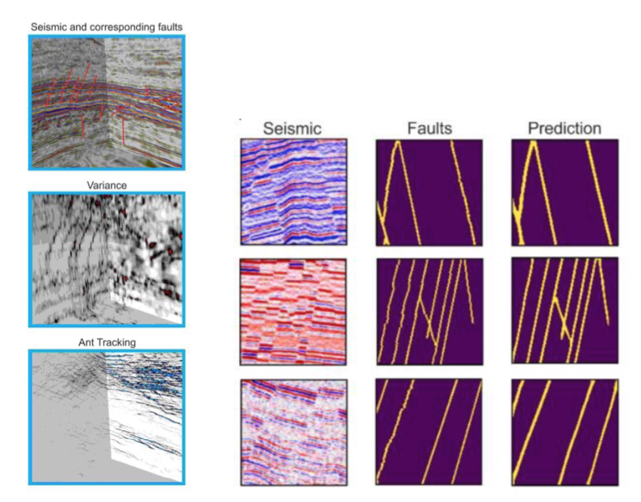

* Conventional methods significantiy affected by different noises and have problems with delineation of faults without high amplitudes

* Most of conventional methods does not provide probability estimation

* Necessity for tool capable to provide cognitive human-like interpretation

-----

### Ely2013 5D and 4D Pre-stack seismic data completion using tensor nuclear norm (TNN).pdf

Filename: `ely2013 5D and 4D Pre-stack seismic data completion using tensor nuclear norm (TNN).pdf`

<b>ABSTRACT</b>

In this paper we present novel strategies for completion of 5D pre-stack seismic data, viewed as a 5D tensor or as a set of 4D tensors across temporal frequencies. In contrast to exist- ing complexity penalized algorithms for seismic data comple- tion, which employ matrix analogues of tensor decompositions such as HOSVD or use overlapped Schatten norms from differ- ent unfoldings (or matricization) of the tensors, our approach uses a recently proposed decomposition called tensor SVD or tSVD for short, proposed in [Kilmer and Martin (2011)]. We show that seismic data exhibits low complexity under tSVD, i.e. is compressible under tSVD representation, and we sub- sequently propose a new complexity penalized algorithm for pre-stack seismic data completion under missing traces. This complexity measure which we call the Tensor Nuclear Norm (TNN) is motivated by algebraic properties of the tSVD. We test the performance of the proposed algorithms on synthetic and real data and show that missing data can be reliably recov- ered under heavy down-sampling.

This paper will mainly discuss recovery of pre-stack seismic records from incomplete spatial measurements. Ideally, a seis- mic survey would have receiver and source geometries at all of the possible spatial indices, however this rarely occurs due to financial and physical constraints. Instead, only a fraction of the possible shot and receiver locations are recorded and the data is spatially under-sampled, confounding interpretation of the seismic data, see [Trad (2009)] and references therein.

The pre-stack seismic data can be viewed as a 5D data or a fifth order *tensor* consisting of one time or frequency dimen- sion and four spatial dimensions describing the location of the detector and the receiver in a two dimensional plane. This data can then be described in terms of the original (, , , ) coordinate frames or in terms of midpoint receivers and offsets (, , , ). Alternatively, one can also view this data as a col- lection of 4D tensors across the temporal frequencies as con- sidered in [Trad (2009)] and [Kreimer and Sacchi (2011)].

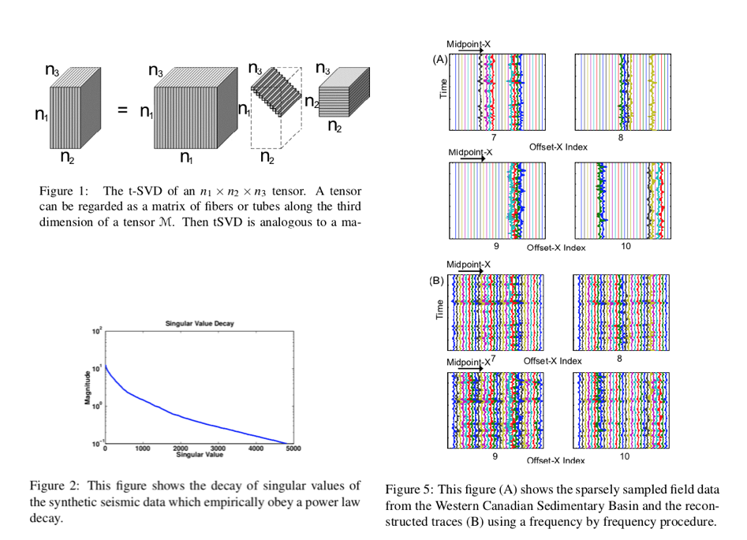

----

### Gasperini2009 SEISPRHO: An interactive computer program for processing and interpretation of high-resolution seismic reflection profiles

Filename: `gasperini2009 SEISPRHO— An interactive computer program for processing and interpretation of high-resolution seismic reflection profiles.pdf`

<b>ABSTRACT</b>

**SeisPrho** is an interactive computer program for processing and interpreting high-resolution seismic reflection profiles developed using the Delphi/Kylix multiplatform programming environment. For this reason, it is available under WindowsTM and LinuxTM operating systems. The program allows the users to handle SEG-Y data files (and other non-standard formats) carrying out a processing sequence over the data to obtain, as a final result, bitmap images of seismic sections. Some basic algorithms are implemented, including filtering and deconvolution. However, the main feature of SEISPRHO is its interactive graphic interface, which provides the user with several tools for interpreting the data, such as reflector picking and map digitizing. Moreover, the program allows importing and geo-referencing maps and seismic profiles in the form of digital images. Trace-by-trace analysis of seismic signal and sea-bottom reflectivity is also implemented, as well as other special functions such as compilation of time-slice maps from close-spaced grids of seismic lines. SEISPRHO is distributed as public domain software for non-commercial purposes by the Marine Geology division of the Istituto di Scienze Marine (ISMAR-CNR). This paper is an introduction to the program and a preliminary guide to the users.

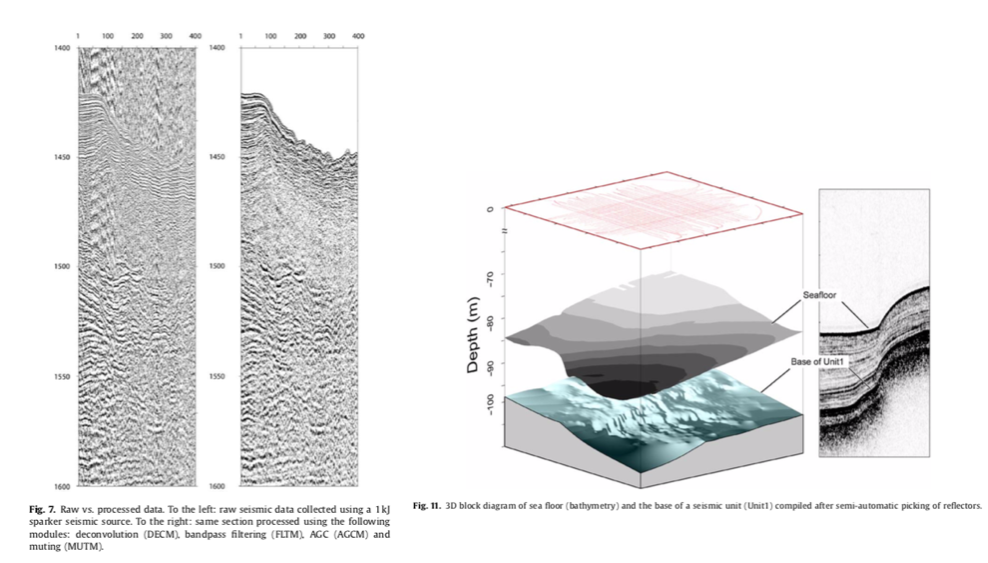

----

### Greenspan2016 Deep Learning in Medical Imaging

Filename: `greenspan2016 Deep Learning in Medical Imaging.pdf`

<b>ABSTRACT</b>

Deep learning is a growing trend in general data analysis and has been termed one of the 10 breakthrough technolo- gies of 2013 [1]. Deep learning is an improvement of artificial neural networks, consisting of more layers that permit higher levels of abstraction and improved predictions from data [2]. To date, it is emerging as the leading machine-learning tool in the general imaging and computer vision domains.

In particular, convolutional neural networks (CNNs) have proven to be powerful tools for a broad range of computer vision tasks. Deep CNNs automatically learn mid-level and high-level abstractions obtained from raw data (e.g., images). Recent results indicate that the generic descriptors extracted from CNNs are extremely effective in object recognition and localization in natural images. Medical image analysis groups across the world are quickly entering the field and applying CNNs and other deep learning methodologies to a wide variety of applications. Promising results are emerging.

In medical imaging, the accurate diagnosis and/or assessment of a disease depends on both image acquisition and image in- terpretation. Image acquisition has improved substantially over recent years, with devices acquiring data at faster rates and in- creased resolution. The image interpretation process, however, has only recently begun to benefit from computer technology. Most interpretations of medical images are performed by physi- cians; however, image interpretation by humans is limited due to its subjectivity, large variations across interpreters, and fatigue. Many diagnostic tasks require an initial search process to detect abnormalities, and to quantify measurements and changes over time. Computerized tools, specifically image analysis and machine learning, are the key enablers to improve diagnosis, by facilitating identification of the findings that require treat- ment and to support the expert’s workflow. Among these tools, deep learning is rapidly proving to be the state-of-the-art foun- dation, leading to improved accuracy. It has also opened up new frontiers in data analysis with rates of progress not before experienced.

----

### Imhof2003 Seismic Determination of reservoir Heterogeneity-- Characterization of Heavey Oil Reservoirs

Filename: `Imhof2003 Seismic Determination of reservoir Heterogeneity-- Characterization of Heavey Oil Reservoirs.pdf`

<b>ABSTRACT</b>

The objective of the project is to examine how seismic data can be used to parameterize models of small-scale reservoir heterogeneity. Although these heterogeneities cannot be resolved individually (deterministically) using seismic data, one can at least attempt to estimate their statistical properties from seismic data. Initially we planned to derive geological and geophysical heterogeneity models in an independent manner to allow comparison, but we came to believe that no single approach will suffice for the Coalinga field. Instead, geological and geophysical models need to be integrated early to succeed in complex environments.

Reservoir characterization is an essential step in delineation, development, and production of hydrocarbon reserves. Our test area, the giant Coalinga Field in California’s San Joaquin Valley, is a good example. Large-scale steamflood projects have been utilized for many years in order to enhance recovery of heavier oil. Steamfloods are costly to operate due to the necessary infrastructure and their energy consumption. Optimally, injected steam would spread evenly from the injection point and push the oil toward the producer wells. In reality, the steam patterns are very complex. Reservoir characterization provides an improved understanding of the reservoir and the movement of steam, which will help to increase the profitability by reducing steam injection which decreases the environmental impact of steam injection. Reservoir heterogeneity affects not only the steamflood, but also the production. The Coalinga reservoirs are strongly compartmentalized which is aggravated by the high oil viscosity. Reservoir characterization helps siting infill wells to produce bypassed oil to increase ultimate recovery.

The objective of the project is to examine how seismic and geologic data can be used to describe small scale heterogeneity and parameterize the reservoir models. Although these heterogeneities cannot be resolved individually (deterministically) using seismic data, we attempt to estimate their statistics from seismic data. The Coalinga field contains more than 2000 wells which provide the unusual luxury that even small-scale heterogeneity can be characterized with well data. The site allows construction of reservoir models from either seismic data or wireline logs and outcrops. Since these data are independent, the models could be compared and validated against each other. No single heterogeneity model, however, can characterize the heterogeneity of Coalinga field. Instead, geologic and geophysical heterogeneity models need to be integrated early.

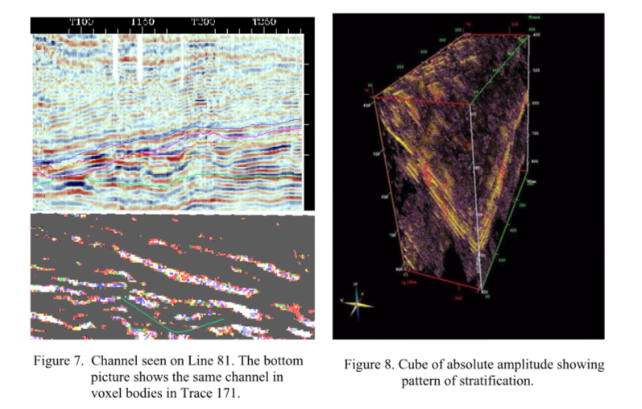

-----

### Keynejad2018 Application of Machine Learning Algorithms in Hydrocarbon Exploration and Reservoir Characterization

Filename: `Keynejad2018 Application of Machine Learning Algorithms in Hydrocarbon Exploration and Reservoir Characterization  azu_etd_16481_sip1_m [repaired thesis].pdf`

<b>ABSTRACT</b>

This dissertation presents novel approaches to evaluate complex seismic and well-log data using machine learning algorithms with examples from two different hydrocarbon fields. The applicability of these algorithms for predicting and classifying direct or indirect hydrocarbon indicators are assessed and compared to knowledge-driven methods. The efficacy of the various techniques leads to recommendations for utilizing machine learning algorithms in well planning or later cycle hydrocarbon-field development.

In the first study in this dissertation, application of a model-based artificial neural network is compared to the performance of a prestack simultaneous inversion method in predicting hydrocarbon presence in the Heidrun Field, offshore Norway. Low-frequency initial models were used to create 3D Poisson’s ratio models to reflect the fluid within this field and the results were compared based on the accuracy and generalization power of the two methods. The results of both methods confirmed Poisson’s ratio to be a good direct hydrocarbon indicator within the wells used from this field. The direct dependency of the inversion method on the provided input constraints, however, can raise the risk for well planning decisions beyond the known zones. The generalize regression neural network results better matched the observations at the training wells and provided a lower risk of false discoveries in delineating favorable zones beyond the drilled wells.

The second study was conducted with the aim of classifying different facies from well logs in wells of the Heidrun Field and in the Kupe Field, offshore New Zealand. Different machine learning approaches were utilized in this study and to investigate quantitatively and qualitatively the accuracy and stability of their predictions. Both supervised methods could successfully predict hydrocarbon-bearing units, with the bagged tree algorithm having a higher overall, and hydrocarbon-related, accuracy rate. Application of the bagged- tree algorithm showed a very low false discovery rate for oil sands and no false discoveries for gas sands in the Heidrun Field. A misclassification of oil sands as brine sands in one Heidrun well is in agreement with relatively high Poisson’s ratios as discussed in the first study. Qualitative investigations of Kupe Field results also demonstrated accurate prediction of hydrocarbon-bearing units, including a shaly hydrocarbon sand class defined for low-quality reservoir sands. Hydrocarbon shows reported in one well that were not predicted by the algorithm, in fact, occur in a very low-porosity section of the reservoir that was not identified as reservoir in reports either.

In the last study, the classifications of the litho-fluid facies were extended to three dimensional models using two machine learning methods and were compared with a knowledge-driven approach. The results were examined through a probabilistic approach to reflect the uncertainty of the predicted classes. The probabilistic neural network and the bagged-tree algorithm successfully predicted the variations of litho-fluid facies, especially for hydrocarbon units. Both methods predicted gas sands in certain parts of the field, away from control points, with similar form and lateral dimension. By comparing the results in predicting oil sands and shale, we interpret the bagged-tree method to be more adherent to the known parameters set by the interpreter, such as the OWC and the target classes. Predictions from the probabilistic neural network, however, can deviate from the target facies even close to the wells on which it has been trained.

The efficiency of machine learning techniques in increasing the prediction accuracy and decreasing the procedure time, and their objective approach toward the data, make it highly desirable to incorporate them in seismic data analyses. Along with the emphasis on the application of machine learning techniques in the study of subsurface properties, this dissertation presents frameworks for utilizing these techniques as new tools for the interpreter, not as a replacement. The knowledge of the data analyst about the field, and the selection and preparation of the attributes and application of the appropriate algorithm are all crucial factors in this procedure.

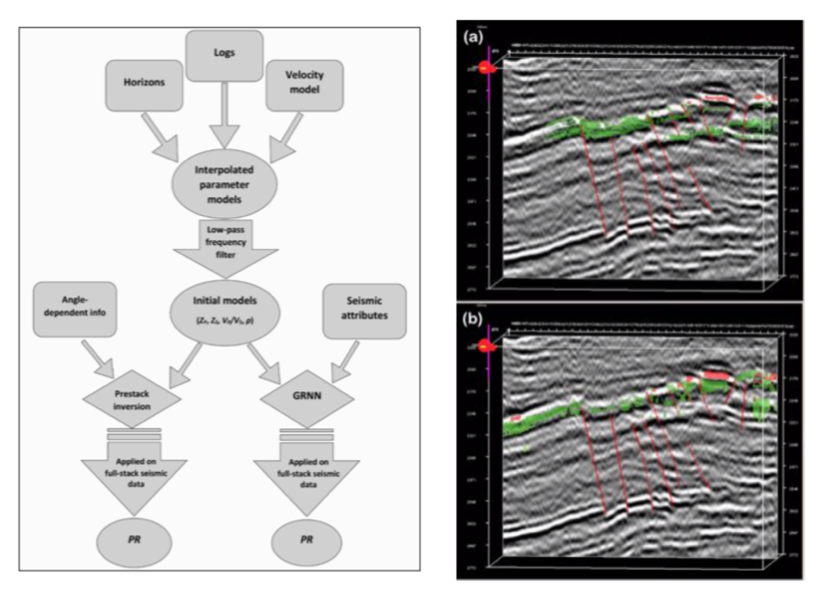

-----

### Milletari2016 Fully Convolutional Neural Networks for  Volumetric Medical Image Segmentation

Filename: `Milletari2016 Fully Convolutional Neural Networks for  Volumetric Medical Image Segmentation 1606.04797.pdf`

<b>ABSTRACT</b>

Convolutional Neural Networks (CNNs) have been recently employed to solve problems from both the computer vision and medical image analysis fields. Despite their popularity, most approaches are only able to process 2D images while most medical data used in clinical practice consists of 3D volumes. In this work we propose an approach to 3D image segmentation based on a volumetric, fully convolutional, neural network. Our CNN is trained end-to-end on MRI volumes depicting prostate, and learns to predict segmentation for the whole volume at once. We introduce a novel objective function, that we optimise during training, based on Dice coefficient. In this way we can deal with situations where there is a strong imbalance between the number of foreground and background voxels. To cope with the limited number of annotated volumes available for training, we augment the data applying random non-linear transformations and histogram matching. We show in our experimental evaluation that our approach achieves good performances on challenging test data while requiring only a fraction of the processing time needed by other previous methods.

Recent research in computer vision and pattern recognition has highlighted the capabilities of Convolutional Neural Networks (CNNs) to solve challenging tasks such as classification, segmentation and object detection, achieving state-of-the- art performances. This success has been attributed to the ability of CNNs to learn a hierarchical representation of raw input data, without relying on hand- crafted features. As the inputs are processed through the network layers, the level of abstraction of the resulting features increases. Shallower layers grasp local information while deeper layers use filters whose receptive fields are much broader that therefore capture global information [19].

Segmentation is a highly relevant task in medical image analysis. Automatic delineation of organs and structures of interest is often necessary to perform tasks such as visual augmentation [10], computer assisted diagnosis [12], interventions [20] and extraction of quantitative indices from images [1]. In particular, since diagnostic and interventional imagery often consists of 3D images, being able to perform volumetric segmentations by taking into account the whole volume content at once, has a particular relevance. In this work, we aim to segment prostate MRI volumes. This is a challenging task due to the wide range of appearance the prostate can assume in different scans due to deformations and variations of the intensity distribution. Moreover, MRI volumes are often affected by artefacts and distortions due to field inhomogeneity. Prostate segmentation is nevertheless an important task having clinical relevance both during diagnosis, where the volume of the prostate needs to be assessed [13], and during treatment planning, where the estimate of the anatomical boundary needs to be accurate [4,20].

-----

### Mohebian2017 A Comparative Study of the Neural Network, Fuzzy Logic, and Neuro-fuzzy Systems in Seismic Reservoir Characterization

Filename: `Mohebian2017 A Comparative Study of the Neural Network, Fuzzy Logic, and Neuro-fuzzy Systems in Seismic Reservoir Characterization.pdf`

<b>ABSTRACT</b>

Intelligent reservoir characterization using seismic attributes and hydraulic flow units has a vital role in the description of oil and gas traps. The predicted model allows an accurate understanding of the reservoir quality, especially at the un-cored well location. This study was conducted in two major steps. In the first step, the survey compared different intelligent techniques to discover an optimum relationship between well logs and seismic data. For this purpose, three intelligent systems, including probabilistic neural network (PNN), fuzzy logic (FL), and adaptive neuro-fuzzy inference systems (ANFIS) were used to predict flow zone index (FZI). Well derived FZI logs from three wells were employed to estimate intelligent models in the Arab (Surmeh) reservoir. The validation of the produced models was examined by another well. Optimal seismic attributes for the estimation of FZI include acoustic impedance, integrated absolute amplitude, and average frequency. The results revealed that the ANFIS method performed better than the other systems and showed a remarkable reduction in the measured errors. In the second part of the study, the FZI 3D model was created by using the ANFIS system.The integrated approach introduced in the current survey illustrated that the extracted flow units from intelligent models compromise well with well-logs. Based on the results obtained, the intelligent systems are powerful techniques to predict flow units from seismic data (seismic attributes) for distant well location. Finally, it was shown that ANFIS method was efficient in highlighting high and low-quality flow units in the Arab (Surmeh) reservoir, the Iranian offshore gas field.

In this study, the application of intelligent systems to finding a better relationship between seismic attributes and well log data on well locations, and to estimating the hydraulic flow units on out of well locations was discussed. Acoustic impedance, integrated absolute amplitude, and the average frequency were selected with stepwise-regression as the optimal attributes for the estimation of hydraulic flow units.

The principal objectives of the current research are as follows:

(a) The intelligent systems, including probabilistic neural network (PNN), fuzzy logic (FL), and adaptive neuro-fuzzy inference system (ANFIS) were used to predict FZI data in a 3D reservoir cube with seismic attributes;

(b) The results of the systems used to predict FZI data were compared together.

(c) The basic concepts and the validity of the applied intelligent systems in solving problems with different methodologies were verified.

-----

### Naeini2018 Seismic - learning from machines

Filename: `naeini2018 Seismic - learning from machines.pdf`

<b>ABSTRACT</b>

Machine learning has been around for decades or, depending on your view, centuries. To consider the tools and underpinnings of machine learning, one would need to go back to the work of Bayes and Laplace, the derivation of least squares, and Markov chains, all of which form the basis and the probability construct used pervasively in machine learning. There has been a flood of progress between 1950 (with Alan Turing’s proposal of a learning machine) and early 2000 (with practical applications of deep learning in place and more recent advances such as AlexNet in 2012). Deep learning has demonstrated tremendous success in a variety of application domains in the past few years, and with some new modalities of applications, it continues to open new opportunities. The recent popularity and emergence of machine learning in the oil and gas industry is likely due to the abundance of unused or overlooked data and the economic need to extract additional information from the data currently used. Additionally, there is an unprecedented availability of computing power, easy- to-use coding libraries, and application programming interfaces, as well as recent and significant advances in various flavors of neural networks. In this paper, we will attempt to show how machine learning can assist geoscientists in performing routine tasks in a much shorter time frame. We assert that there is a great opportunity for geoscientists to learn from machines, use these techniques to quality check their work, and gain nuanced insights from their data. Another advantage is that these approaches lead to the optimization of machine learning workflows by providing more accurate training data sets thus driving continuous learning and enhancement of the model.

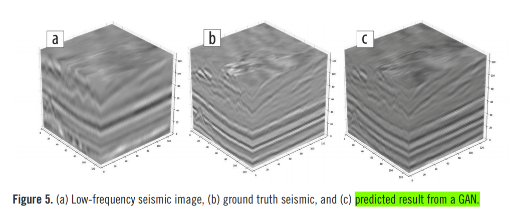

-----

### Picetti2019 Seismic image processing through the generative adversarial network

Filename: `Picetti2019 Seismic image processing through the generative adversarial network.pdf`

<b>ABSTRACT</b>

The advent of new deep-learning and machine-learning paradigms enables the development of new solutions to tackle the challenges posed by new geophysical imaging applications. For this reason, convolutional neural networks (CNNs) have been deeply investigated as novel tools for seismic image processing. In particular, we have studied a specific CNN architecture, the generative adversarial network (GAN), through which we process seismic migrated images to obtain different kinds of output depending on the application target defined during training. We have developed two proof-of-concept applications. In the first application, a GAN is trained to turn a low-quality migrated image into a high-quality one, as if the acquisition geometry was much more dense than in the input. In the second example, the GAN is trained to turn a migrated image into the respective deconvolved reflectivity image. The effectiveness of the investigated approach is validated by means of tests performed on synthetic examples.

State-of-the-art seismic imaging algorithms (e.g., full- waveform inversion and least-squares reverse time mi- gration [LS-RTM]) solve large-scale ill-posed inverse problems. Therefore, the study of iterative inversion methods, convex optimization and regularization strat- egies, and the formulation of appropriate cost functions played a key role in seismic imaging, as well as for similar problems (e.g., medical imaging.

... the recent amazing development of machine learning, and in particular of deep learning and convolutional neural networks (CNNs), suggests new thinking and a huge potential for imaging-related fields (Lucas et al., 2018). 

As a matter of fact, CNNs greatly impacted the whole signal and image processing community, and most image processing problems are, de facto, inverse problems (e.g., inpainting and deblurring). In particular, among the different architectures, generative adversarial networks (GANs) emerged as a promising approach to impose some form of regularization that is not easy to express through simple modeling (Goodfellow et al., 2014). 

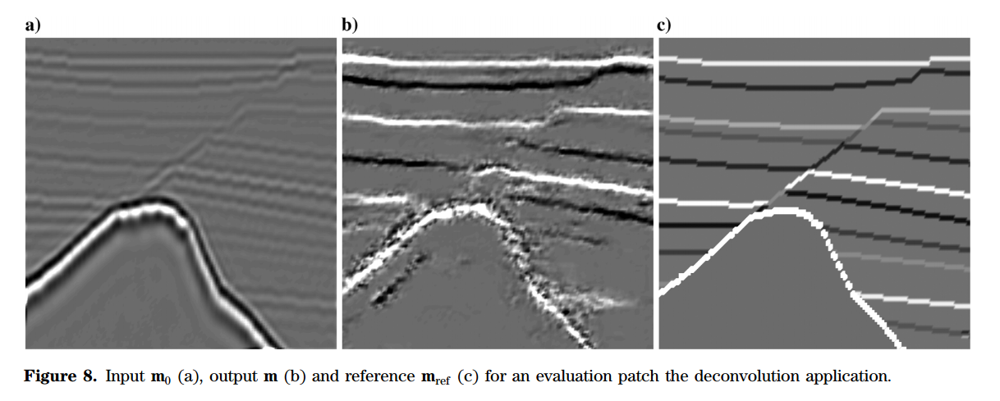

----

### Segy-change— The swiss army knife for the SEG-Y files

Filename: `Segy-change— The swiss army knife for the SEG-Y files.pdf`

<b>ABSTRACT</b>

Data collected during active and passive seismic surveys can be stored in many different, more or less standard, formats. One of the most popular is the SEG-Y format, developed since 1975 to store single- line seismic digital data on tapes, and now evolved to store them into hard-disk and other media as well. Unfortunately, sometimes, files that are claimed to be recorded in the SEG-Y format cannot be processed using available free or industrial packages. Aiming to solve this impasse we present segy-change, a pre- processing software program to view, analyze, change and fix errors present in SEG-Y data files. It is written in C language and it can be used also as a software library and is compatible with most operating systems. Segy-change allows the user to display and optionally change the values inside all parts of a SEG- Y file: the file header, the trace headers and the data blocks. In addition, it allows to do a quality check on the data by plotting the traces. We provide instructions and examples on how to use the software.

-----

### SLC Paris 2014_Seismic Standards in the SLC_SEG.pdf

Filename: `SLC Paris 2014_Seismic Standards in the SLC_SEG.pdf`

<b>ABSTRACT</b>

**SEG History**

- 1930 On 11 March, twenty-nine men and one woman met in Houston at the University Club to found the Society of Economic Geophysicists.
- 1931 The group's name was changed to Society of Petroleum Geophysicists (SPG), and the first convention was held in conjunction with AAPG
- 1937 Once again the name of the organization was changed, this time to Society of Exploration Geophysicists. Accepted as an Affiliated Society by AAPG
- 1955 SEG held its last joint meeting with AAPG, then celebrated its twenty-fifth anniversary with a separate meeting in Denver.
- 1973 Sheriff produced SEG's all time best-seller, Encyclopaedic Dictionary of Exploration Geophysics. The creation of a Technical Standards Committee
- 1975 Publication of the Technical Standards Book for SEGA, SEGB, SEGC and SEGD

-----

### Tingdahl2005 Semi-automatic detection of faults in 3D seismic data

Filename: `Tingdahl2005 Semi-automatic detection of faults in 3D seismic data.pdf`

<b>ABSTRACT</b>

The semi-automated detection of objects has been quite successful in detecting various types of seismic object, such as chimneys. The same technique can be applied success- fully to detect faults in 3D seismic data. We show that several different attributes – among others, similarity, frequency and curvature, all of which potentially enhance the visibility of faults – can be combined successfully by an artificial neural network. This results in a fault ‘probability’ cube in which faults are more continuous and noise is suppressed compared with single-attribute cubes. It is believed that the fault-cube can be improved further by applying image-processing techniques to enhance the fault prediction.

Coherence cubes (Bahorich and Farmer 1995; Marfurt et al. 1998) are often used to highlight reflector edges and to guide the picking process. Enhanced attribute cubes can be even more helpful and are used to automate parts of the manual workflow.

Most attributes are non-unique; one attribute can respond to other objects as well as just faults. There is no perfect fault attribute, but many attributes can contribute to fault inter- pretation. 

The semi-automatic approach to seismic object detection, developed by Meldahl et al. (1999), uses directive attributes (i.e. attributes that are extracted in user- or data-steered di- rections) and neural networks to highlight objects of interest. The method was initially applied to highlight seismic chim- neys for the interpretation of hydrocarbon migration paths (Heggland et al. 1999; Tingdahl, Bril and de Groot 2001). The same methodology can be used to detect other seismic objects, such as faults, reflectors and bright spots. This paper focuses on adapting the methodology to detect faults in 3D seismic data.

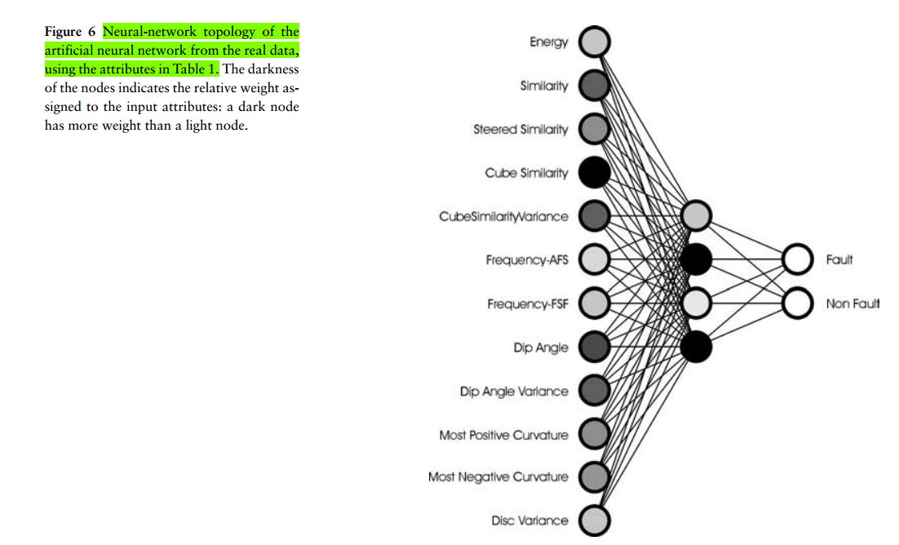

----

### Wu2018Cnnf Convolutional neural networks for fault interpretation in seismic images.pdf

Filename: `wu2018Cnnf Convolutional neural networks for fault interpretation in seismic images.pdf`

<b>ABSTRACT</b>

We propose an automatic fault interpretation method by using convolutional neural networks (CNN). In this method, we con- struct a 7-layer CNN to first estimate fault orientations (dips and strikes) within small image patches that are extracted from a full seismic image. With the estimated fault orientations, we then construct anisotropic Gaussian functions that mainly ex- tend along the estimated fault dips and strikes. We finally stack all the locally fault-oriented Gaussian functions to generate a fault probability image. Although trained by using only syn- thetic seismic images, the CNN model can accurately estimate fault orientations within real seismic images. The fault prob- ability image, computed from the estimated fault orientations, displays cleaner, more accurate, and more continuous fault fea- tures than those in the conventional fault attribute images.

In this paper, we consider fault orientation estimation as an image classification problem by assuming a local fault within a small seismic image is a line (2D) or plane (3D) that is uniquely defined by a single fault orientation. Inspired by the success of CNN in variant classification tasks, we propose to use CNN to classify fault orientations within the small seis- mic images. We construct a CNN model with 6 convolutional layers followed by a fully connected layers and a final out- put vector of a fault orientation prediction. We train the CNN model by using 200,000 synthetic seismic image patches that are automatically computed as illustrated in Figure 2. We fur- ther apply the trained CNN model to classify the orientations of the faults in small seismic patches that are extracted from an input full seismic image. With the estimated fault orienta- tions, we compute fault probability patches with fault-oriented linear features. All the fault probability patches have the same size of the extracted seismic patches and are further stacked to compute a full fault probability image as shown in Figure 1d.

-----

### Wu2019 FaultNet3D: Predicting Fault Probabilities, Strikes, and Dips With a Single Convolutional Neural Network

Filename: `wu2019 FaultNet3D— Predicting Fault Probabilities, Strikes, and Dips With a Single Convolutional Neural Network [resized].pdf`

<b>ABSTRACT</b>

We simultaneously estimate fault probabilities, strikes, and dips directly from a seismic image by using a single convolutional neural network (CNN). In this method, we assume a local 3-D fault is a plane defined by a single combination of strike and dip angles. We assume the fault strikes and dips, respectively, are in the ranges of [0◦,360◦] and [64◦,85◦], which are divided into 577 classes corresponding to the situation of no fault and 576 different combinations of strikes and dips. We construct a 7-layer CNN to classify the fault strike and dip in a local seismic cube and obtain the classification probability at the same time. With the fault probability, strike and dip estimated at some seismic pixel, we further compute a fault cube (centered at the pixel) with fault features elongated along the fault plane. By sliding the classification window within a full seismic image, we are able to obtain a lot of overlapping fault cubes which are stacked to compute three full images of enhanced and continuous fault probabilities, strikes, and dips. To train the CNN model, we propose an effective and efficient workflow to automatically create 900000 synthetic seismic cubes and the corresponding fault class labels. Although trained with only synthetic data sets, our CNN model can be applied to accurately estimate fault probabilities, strikes, and dips within field seismic images that are acquired at totally different surveys. With the estimated three fault images, we further construct fault cells that are represented as small 3-D squares, each square is colored by fault probability and oriented by fault strike and dip. We recursively link the fault cells by following the fault strikes and dips to finally construct fault skins, which are simple linked data structures to represent fault surfaces.

Interpreting faults from seismic reflection images is a key step for building structural models [1], [2] and reservoir characterization [3], [4]. In a seismic image, the most dominant features are reflection events corresponding to geologic horizons [5]–[7] while faults are often recognized as reflection discontinuities. Therefore, fault interpretation typically requires first computing a fault probability image from the seismic image so that the faults are highlighted while the reflections are removed. Such a fault probability image can be estimated from numerous types of seismic attributes that measure reflection discontinuity or continuity. Such attributes include semblance [8], [9], coherency [10]–[14], variance [15], [16], and gradient magnitude [17]. A fault prob- ability image based on discontinuity measurement, however, often highlights other discontinuous seismic features including stratigraphic features (e.g., channels and unconformities) and noise as shown in Fig. 1(a)–(e). To further enhance fault features while suppressing the features unrelated to faults, several researchers [18]–[22] propose to apply fault-oriented averaging or smoothing in computing a fault probability image like the fault likelihood image [20], [21] shown in Fig. 1(f). Other researchers propose to directly enhance the fault features in a fault probability image by using ant tracking [23] or optimal surface voting [24] as shown in Fig. 1(g).

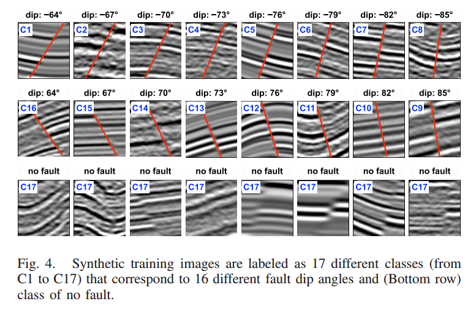

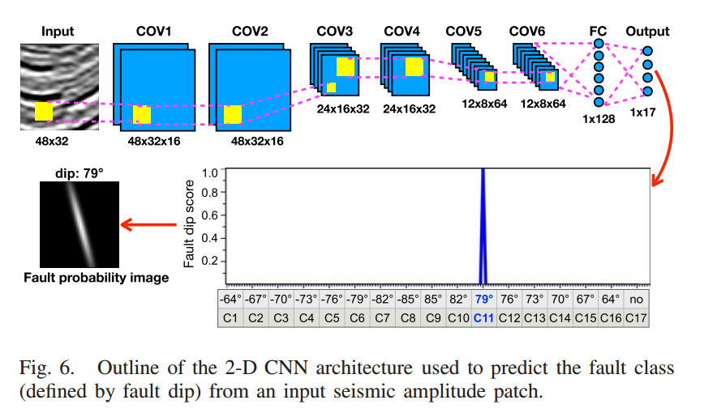

-----

### Xiong2018 Seismic fault detection with convolutional neural networks.pdf

Filename: `xiong2018 Seismic fault detection with convolutional neural networks.pdf`

<b>ABSTRACT</b>

Mapping fault planes using seismic images is a crucial and time-consuming step in hydrocarbon prospecting. Conventionally, this requires significant manual efforts that normally go through several iterations to optimize how the diffferent fault planes connect with each other. A broad range of techniques have been developed to automate this process like seismic coherence estimation, edge detection and ant-tracking, to name a few. However, these techniques do not take advantage of the valuable experience accumulated by the interpreters. We have developed a method that uses convolutional neural network (CNN) to automatically detect and map fault zones using 3D seismic images in a similar fashion to the way done by interpreters. This new technique is implemented in two steps: training and prediction. In the training step, a CNN model is trained with annotated seismic image cubes of field data, Where every point in the seismic image is labeled as fault or non-fault. In the prediction step, the trained model is applied to compute fault probabilities at every location in other seismic image cubes. Unlike reported methods in the literature, our technique does not require pre-computed attributes to predict the faults. We verified our approach on both synthetic and field datasets. We clearly demonstrated that CNN-computted fault probability outperforms that obtained using the coherence technique in terms of exhibitiing clearer discontinuitiies. With the capabiility of emulating human experience and evolving through training using new field datasets, deep learning tools manifest huge potential in automating and advancing seismic fault mapping.

Seismic fault detection and characterization is a crucial and time-consuming task in seismic interpretation (Bahorich and Farmer, 1995; Aqrawi and Boe, 2011). The discontinuities need to be hand-picked from raw seismic images, which may take weeks to months on a typical-size seismic volume by an experienced interpreter. The picking results are highly dependent on the experience of interpreters, and so human-bias is inevitable. Many tools have been developed to assist interpreters for this labor-intensive task, such as coherence feature extraction from the image (Bahorich and Farmer, 1995; Luo et al., 1996; Dorn, 1998; Wu 2017), automatic tracking of the discontinuities (Admasu et al., 2006) and automatic fault extraction (Dorn et al., 2005). Many of them are deterministic methods, which suffer two types of limitations. First, such methods cannot adapt easily to various kinds of discontinuities in different seismic images. For instance, coherence technology is less sensitive to faults that are changing gradually, i.e., not sharp. Second, deterministic methods themselves cannot learn or evolve based on interpreters’ experience in a systematic manner. Therefore, the picking quality will always be affected by human bias. Picking results are relying heavily on the best interpreters’ knowledge and experience, which disappear when they retire. New interpreters therefore need to be continually trained to learn from the experienced ones.

Machine learning (especially deep learning) technologies are powerful for mining features or relationships from data, which makes them quite suitable for learning from human experience (Fulkerson et al., 1995; LeCun et al., 2015; Schmidhuber, 2015). Many novel data-driven technologies have been developed in the field of deep learning to perform big-data analytics automatically. One of the most popular deep learning technologies is the convolutional neural network (CNN), with successful applications in image recognition and classification (LeCun and Bengio, 1998; Krizhevsky et al., 2012). CNNs have been intensively and broadly used in identifying faces, objects, traffic signs and recognizing speeches, besides powering vision in robots and sellf-driving cars (Lawrence et a21l1.., 1997; Abdel-Hamid et al., 2014; LeCun et al, 2010; Bojarski et al, 2016). For example, they can take an image as an input and tell us what is in the image. The state-of-the-art CNNs can recognize images even better than humans. Deep learning technologies are showing great potential in many scientific fields other than computer science. There is also increasing interest in applying machine learning or deep learning technologies to seismic data processing and interpretation, such as seismic phase classiification (Ramirez Jr and Meyer, 2011), data interpolation (Jia and Ma, 2017), as welll as geophysical feature extraction (Huang et al, 2017; Chehrazi et al., 2013). Some recent work has proposed new approaches based on deep learning technologies for automatic geophysical feature extraction such as fault detecttion from pre-migrated data with 2D and 3D synthetic tests (Zhang et al., 2014; Chehrazi et al., 2013; Araya-Polo et al., 2017). This work shows promising results from applying deep learning technologies in geophysics.

In this paper, we introduce the CNN for detecting geologic faults from 3D seismic images for practical applications. A CNN model is trained to detect faults from raw seismic images sampled on 3D grids or voxels in a supervised learning approach. Real data from 7 annotated seismic cubes are used to generate the training dataset with one seismic cube used for validation. We first demonstrate the capabiility of the trained model for fault detection by applying it to a synthetic seismic image cube with artificial faults. For real data tests, the trained network is then applied to a different seismic cube that the network has never seen in the training process. The fault probabiliittyy derived from the CNN shows similar but better highlighting of seismic discontinuities than seismic coherence.

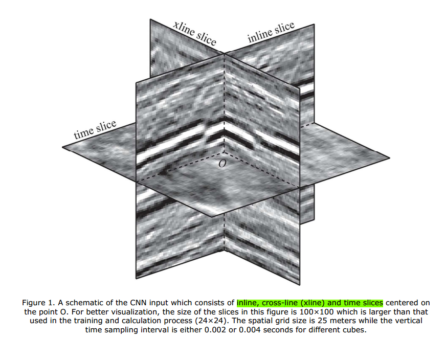

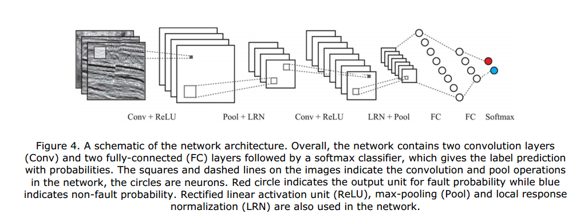

## Researchers

### ### Xinming Wu

[Google scholar](https://scholar.google.com/citations?user=1quj_OcAAAAJ&hl=en)

### Ghassan AlRegib

[Google scholar](https://scholar.google.com/citations?user=7k5QSdoAAAAJ&hl=en)

